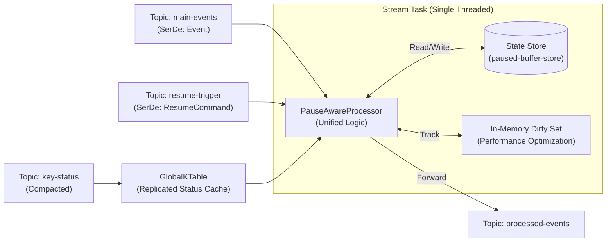
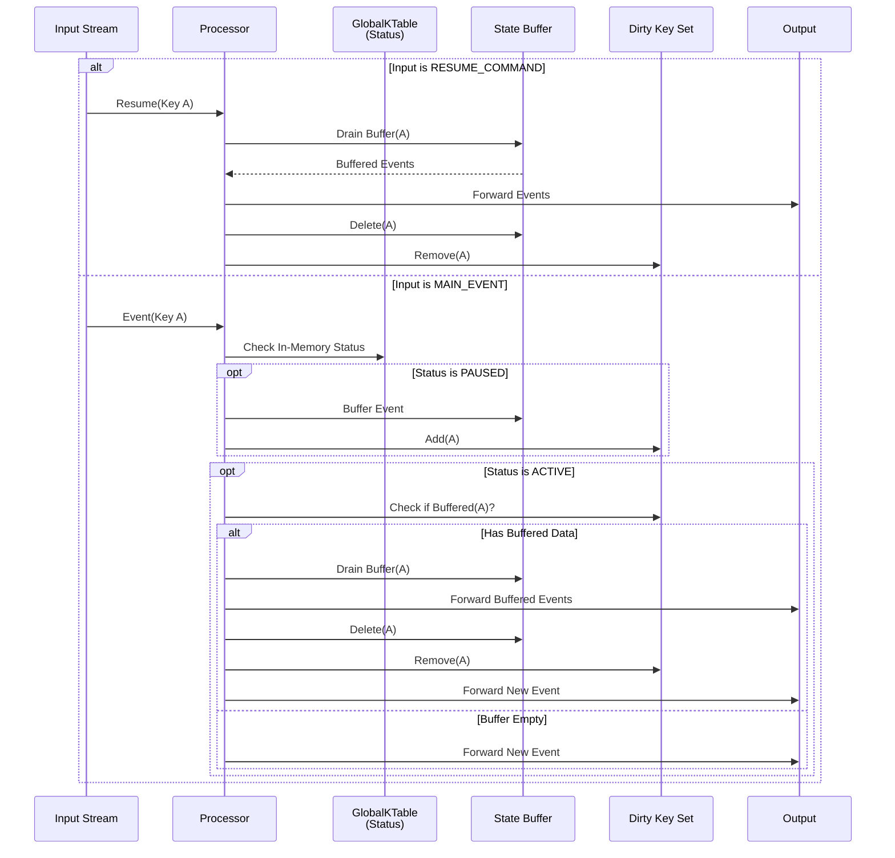
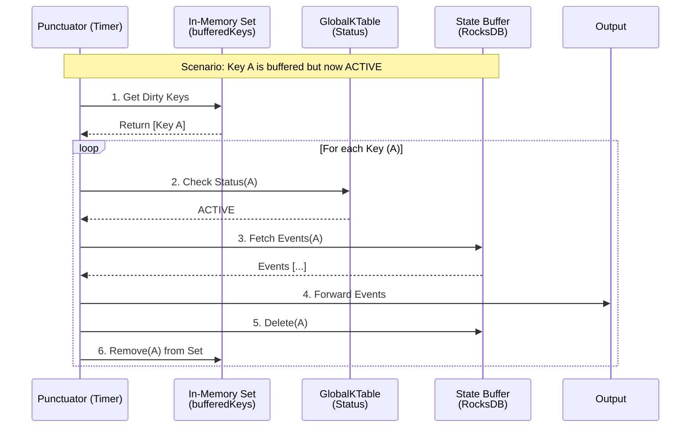

# Kafka Streams Pause-Aware Architecture (Strict Ordering Edition)

This document describes a robust, Kafka-native architecture for conditionally pausing and resuming event processing. It is specifically designed to guarantee **Strict Per-Key Ordering** ($Old Buffered Events \rightarrow New Events$) by eliminating race conditions common in distributed systems.

## Core Architecture

### The "Unified Processor" Pattern
Unlike traditional designs that separate "Trigger" and "Event" processing, this architecture routes both the main-events stream and the resume-trigger command stream into a single, unified Processor Node.

Because Kafka Streams assigns a single thread per partition, processing is inherently synchronous. By handling the Resume Command and New Events in the same thread, we guarantee that the buffer drain completes atomically before any new event is touched.

### Architecture Diagram


### Component Breakdown
| Component | Type | Purpose |
| :--- | :--- | :--- |
| **PauseAwareProcessor** | Unified Node | The heart of the system. Consumes both Events and Triggers. Enforces "Drain-Before-Process" logic. |
| **paused-buffer-store** | State Store | Persistent, disk-backed storage for events arriving while Paused. Backed by a changelog topic for fault tolerance. |
| **Dirty Key Set** | In-Memory Set | Tracks which keys currently have data in the buffer to avoid scanning the entire database during maintenance checks (O(1) access vs O(N) scan). |
| **key-status** | Compacted Topic | The source of truth for whether a key is ACTIVE or PAUSED. |
| **GlobalKTable** | View | Provides low-latency local lookups of key-status inside the processor. |

## Logic & Data Flow

### 2.1 The "Drain-First" Guarantee
To ensure new events never "cut in line" ahead of buffered events, the processor follows this strict decision tree for every incoming record:

1. **If Input is RESUME_COMMAND:**
   - **Action**: Immediately iterate through the `paused-buffer-store`.
   - **Action**: Forward all buffered events downstream using their original timestamps.
   - **Action**: Delete buffer content and remove from Dirty Key Set.
   - *Note: This is a blocking operation, guarded by MAX_BUFFER_SIZE to prevent thread stalling.*

2. **If Input is MAIN_EVENT:**
   - **Check 1**: Is GlobalKTable status `PAUSED`?
     - $\rightarrow$ Buffer the event. Add to Dirty Key Set. Stop.
   - **Check 2**: Is GlobalKTable status `ACTIVE`?
     - **CRITICAL STEP**: Check `paused-buffer-store` size via Dirty Key Set.
     - **If Buffer NOT Empty** (Race condition or Lag detected):
       - Drain Buffer.
       - Forward New Event.
     - **If Buffer Empty**:
       - Forward New Event.

### Drain-First Logic Flow


### 2.2 Handling "Stranded" Events (The Safety Punctuator)
This architecture specifically addresses the race condition where key-status updates (via GlobalKTable) lag behind the real-time stream.

**The Scalability Solution (Dirty Key Tracking):**
Iterating the entire state store every second is a performance antipattern (O(N)). Instead, we maintain a `Set<String> bufferedKeys` in memory.
- When we write to the buffer, we add the key to the Set.
- When we empty the buffer, we remove the key from the Set.
- The Punctuator only iterates this in-memory Set.

**The Logic:**
```java
foreach (key in bufferedKeys):
   if (GlobalKTable Status is ACTIVE) -> Drain Buffer.
```

### Dirty Key Punctuator Flow


## Quick Start
### Option 1: Run Everything (Recommended)

```bash
chmod +x run_compose.sh
./run_compose.sh
```

This script will:
1.  Start Kafka in Kraft mode via Podman (container: `kafka-poc`).
2.  Initialize all required topics via `scripts/init_topics.sh`.
3.  Build and containerize the backend (Spring Boot).
4.  Build and containerize the frontend (Angular).
5.  Start the entire stack.

Frontend: http://localhost:4200
Backend: http://localhost:8080

### Option 2: Manual Setup

#### 1. Start Infrastructure
```bash
./scripts/start_infra.sh
./scripts/init_topics.sh
```

#### 2. Build and Run Backend
```bash
cd backend
./gradlew clean build
java -jar build/libs/pause-aware-app-0.0.1-SNAPSHOT.jar
```

#### 3. Build and Run Frontend
```bash
cd frontend
npm install
npm start
```

## Project Structure

```
event-pause/
├── backend/                 # Spring Boot application
│   ├── src/main/java/com/example/app/
│   │   ├── config/          # Configuration properties
│   │   ├── control/         # REST controllers
│   │   ├── model/           # Data models
│   │   ├── processor/       # Unified PauseAwareProcessor
│   │   ├── serde/           # Type-safe SerDes (Event, KeyStatus, etc.)
│   │   ├── service/         # Services (Consumers, Store Query)
│   │   └── topology/        # Topology configuration
│   └── src/main/resources/  # application.yml
├── frontend/                # Angular application
│   ├── src/app/
│   │   ├── app.component.*  # Main Dashboard
│   │   └── kafka.service.ts # API Service
├── scripts/                 # Infrastructure scripts
└── run_compose.sh           # Main deployment script
```
