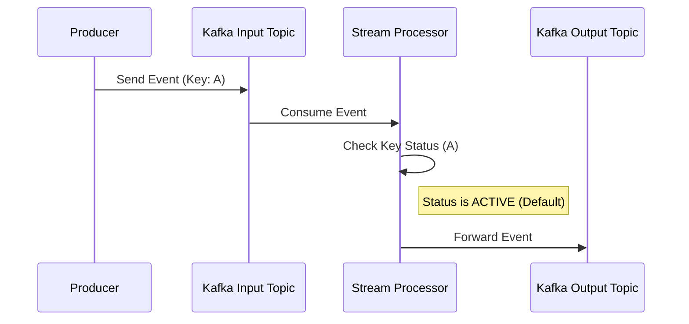
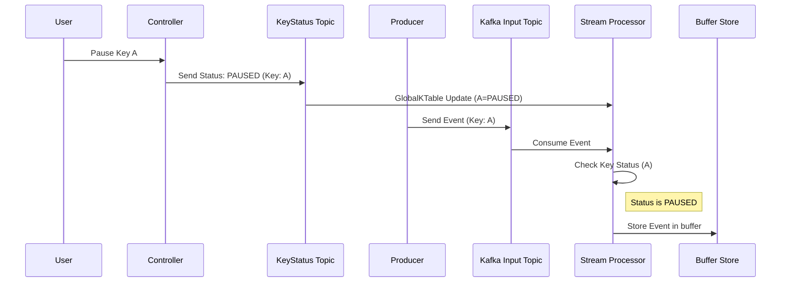
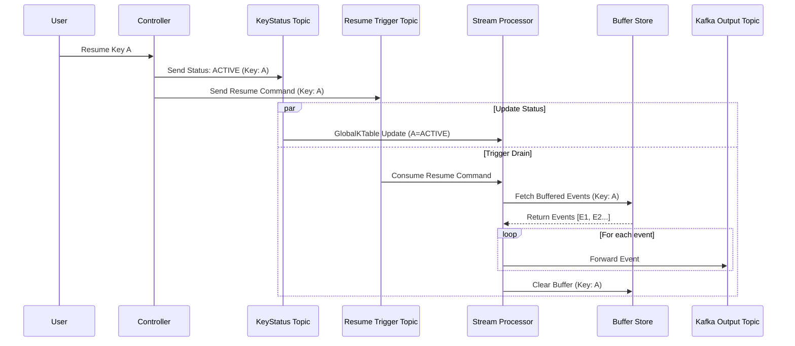

# Kafka Streams Pause-Aware Processing Application

A robust, Kafka-native architecture for conditionally pausing and resuming the processing of events based on their key. This implementation leverages Kafka Streams, Compaction, and the Processor API to ensure high durability, ordering guarantees, and Exactly-Once Semantics (EOS).

## Architecture Overview

### Key Components

1.  **GlobalKTable**: Provides instant, local lookups of the current key status for every Streams instance.
2.  **State Store**: Persistent, local buffering of paused events (e.g., `demo-buffer-store`).
3.  **Compacted Topic**: `key-status` topic stores the latest processing status (ACTIVE/PAUSED) for every entity key.
4.  **Multi-Topic Support**: Parameterized topology builder allows scaling to multiple topics via configuration.
5.  **REST API Polling**: Replaced SSE with robust REST endpoints for fetching input, output, and buffer status.

### Topics

*   `key-status`: Compacted topic storing ACTIVE/PAUSED status for keys.
*   `*-in`: Input topics for events (e.g., `demo-in`, `orders-in`).
*   `*-out`: Output topics for processed events.
*   `*-resume`: Trigger topics used to signal the Resume Processor to drain buffered events.

## Prerequisites

*   Java 21+
*   Gradle 8.0+ (or use Gradle Wrapper)
*   Node.js 18+ and npm
*   Podman (for Kafka infrastructure)

## Quick Start

### Option 1: Run Everything (Recommended)

```bash
chmod +x run_compose.sh
./run_compose.sh
```

This script will:
1.  Start Kafka in Kraft mode via Podman (container: `kafka-poc`).
2.  Initialize all required topics.
3.  Build and containerize the backend (Spring Boot).
4.  Build and containerize the frontend (Angular).
5.  Start the entire stack.

Frontend: http://localhost:4200
Backend: http://localhost:8080

### Option 2: Manual Setup

#### 1. Start Infrastructure
```bash
./scripts/start_infra.sh
./scripts/init_topics.sh
```

#### 2. Build and Run Backend
```bash
cd backend
./gradlew clean build
java -jar build/libs/pause-aware-app-0.0.1-SNAPSHOT.jar
```

#### 3. Build and Run Frontend
```bash
cd frontend
npm install
npm start
```

## Usage

### Frontend UI

1.  **Select Topic**: Choose a flow (demo, orders, payments).
2.  **Send Events**: Enter a Key and Data, click "Send Event".
3.  **Pause/Resume**: Enter a Key to control its status.
4.  **Dashboard**:
    *   **Auto-Refresh**: Toggle to poll for updates every 2 seconds.
    *   **Key Status**: Enter a key to see if it is ACTIVE or PAUSED and view its Buffered Events.
    *   **Tables**: View Input and Output messages side-by-side.

### API Endpoints

*   `POST /control/{topicId}/pause/{key}` - Pause processing for a key.
*   `POST /control/{topicId}/resume/{key}` - Resume processing for a key.
*   `POST /control/{topicId}/send?key={key}&data={data}` - Send a test event.
*   `GET /control/{topicId}/input-messages` - Get the latest messages from the input topic.
*   `GET /control/{topicId}/output-messages` - Get the latest messages from the output topic.
*   `GET /control/{topicId}/status/{key}` - Get the current status (ACTIVE/PAUSED).
*   `GET /control/{topicId}/buffer/{key}` - Get the list of buffered events for a key.

## Sequence Diagrams

### 1. Normal Flow (Active)



### 2. Pause Flow



### 3. Resume Flow



## Configuration

### Adding New Flows

Flows are configured in `backend/src/main/resources/application.yml`. To add a new flow, simply add a new entry to the `app.flows` list:

```yaml
app:
  flows:
    - topicId: new-flow
      mainTopic: new-flow-in
      statusTopic: key-status
      triggerTopic: new-flow-resume
      outputTopic: new-flow-out
      bufferStoreName: new-flow-buffer-store
```

**Note**: You must also ensure the corresponding Kafka topics are created (update `scripts/init_topics.sh`).

## Project Structure

```
event-pause/
├── backend/                 # Spring Boot application
│   ├── src/main/java/com/example/app/
│   │   ├── config/          # Configuration properties
│   │   ├── control/         # REST controllers
│   │   ├── model/           # Data models
│   │   ├── processor/       # Kafka Streams processors
│   │   ├── service/         # Services (Consumers, Store Query)
│   │   └── topology/        # Topology configuration
│   └── src/main/resources/  # application.yml
├── frontend/                # Angular application
│   ├── src/app/
│   │   ├── app.component.*  # Main Dashboard
│   │   └── kafka.service.ts # API Service
├── scripts/                 # Infrastructure scripts
└── run_compose.sh           # Main deployment script
```

